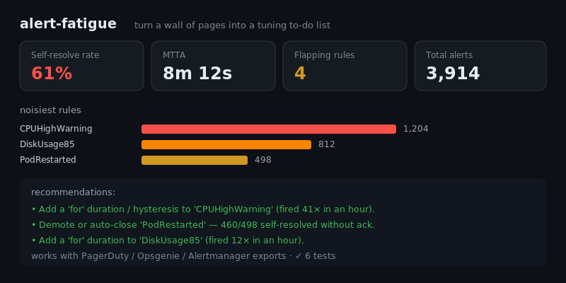

# alert-fatigue

[](https://github.com/JCreatesGH/alert-fatigue/actions)
[](https://www.python.org/)
[](LICENSE)

Turn a wall of pages into a tuning to-do list. `alertfatigue` ingests your alert history and surfaces the noisiest rules, flapping detectors, MTTA, and alerts that **self-resolve without anyone acking them** — then recommends fixes. Works with PagerDuty, Opsgenie, or Alertmanager exports.



## Install

```bash
pip install alertfatigue
```

## Use it

```python
from alertfatigue import load_alerts, summary, recommendations

alerts = load_alerts(history)   # [{rule, opened_at, resolved_at?, acked_at?}, ...]

summary(alerts)
# {"total": 3914, "mtta_s": 492, "mttr_s": 1830, "ack_rate": 0.39,
#  "self_resolve_rate": 0.61, "flapping_rules": 4, "noisiest": [...]}

for rec in recommendations(alerts):
    print(rec)
# Add a 'for' duration / hysteresis to 'CPUHighWarning' (fired 41× in an hour).
# Demote or auto-close 'PodRestarted' — 460/498 self-resolved without ack.
```

## CLI

Installing the package adds an `alertfatigue` command — feed it a JSON array of alert records:

```bash
$ alertfatigue alerts.json                              # summary + recommendations
$ pd-export | alertfatigue --json                       # machine-readable
$ alertfatigue alerts.json --fail-on-recommendations    # exit 1 to gate CI
```

## What it measures

- **Noisiest rules** — simple volume ranking.
- **Flapping** — rules that fire ≥ N times within a rolling window (rolling two-pointer, not just per-hour buckets).
- **MTTA / MTTR** — mean time to acknowledge / resolve.
- **Ack rate** — share of alerts a human actually acknowledged (engagement).
- **Self-resolve rate** — share of alerts that resolved quickly and were *never acked*: the textbook definition of noise that paged someone for nothing.
- **Recommendations** — concrete tuning actions (add hysteresis, demote/auto-close) per offending rule.

## Development

```bash
pip install -e .[dev] && python -m pytest -q   # 12 tests
```

## License

MIT
